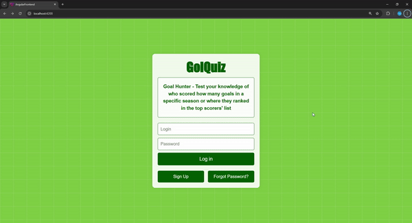
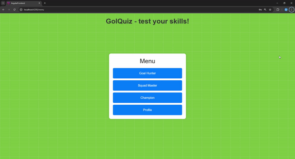
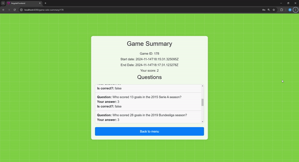

# GolQuiz

GolQuiz is a quiz application built with Django for the backend and Angular for the frontend. This project allows users to participate in quizzes, view rankings, and manage their profiles. Players can choose whether to play solo or play vs another user.

The project was a part of bachelor thesis.

## Features

### Home Page


### Menu and games


### Rankings and profile


## Prerequisites

- Python 3.x
- Node.js and npm
- Angular CLI

## Setup Instructions

### Backend (Django)

1. **Clone the repository:**

    ```sh
    git clone https://github.com/SzymonFit/GolQuiz.git
    ```

2. **Create and activate a virtual environment:**

    ```sh
    python -m venv venv
    source venv/bin/activate  # On Windows, use `venv\Scripts\activate`
    ```

3. **Install the required packages:**

    ```sh
    pip install -r requirements.txt
    ```

4. **Apply migrations and start the Django server:**

    ```sh
    python manage.py migrate
    daphne -b 127.0.0.1 -p 8000 my_quiz_app.python_django.asgi:application
    ```

### Frontend (Angular)

1. **Navigate to the Angular frontend directory:**

    ```sh
    cd my_quiz_app/angular_frontend/src
    ```

2. **Install the required packages:**

    ```sh
    npm install
    ```

3. **Start the Angular development**

    ```sh
    ng s
    ```

## Running the Application

- The Django backend will be running at `http://127.0.0.1:8000/`.
- The Angular frontend will be running at `http://localhost:4200/`.


## License

This project is licensed under the MIT License. See the LICENSE file for details.